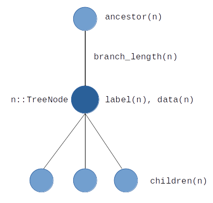

# Basic concepts

To introduce basic concepts and data structures used in TreeTools, we will use the small tree given by this [Newick string](https://en.wikipedia.org/wiki/Newick_format): `"((A:1,B:1)AB:2,C:3)R;"`.
To obtain a tree from the string, run the following code in a julia REPL: 

```@repl basic	
using TreeTools 
nwk = "((A:1,B:1)AB:2,C:3)R;"
tree = parse_newick_string(nwk)
```

## TreeNode

At the basic level, the tree is represented by a set of linked `TreeNode` structures. A node `n` contains the following information: 
- `ancestor(n)` returns the node above `n`. If `n` is the root, `ancestor(n)` returns `nothing`. 
- `children(n)` returns an array containing all the nodes below `n`. If `n` is a leaf, `children(n)` is empty. 
- `label(n)` returns the label of `n`, which also serves as an identifier of `n` in many TreeTools functions. See the warning below. 
- `branch_length(n)` returns the length of the branch above `n` as a `Float64`. If `n` is the root or if it does not have a branch length, it returns `missing`. 
- `data(n)` returns data attached to `n`, see [TreeNodeData](@ref)
- `isroot(n)` and `isleaf(n)` are boolean functions with explicit behavior. 


!!! warning "Node labels"
	TreeTools generally uses the label of nodes as an identifier. This is visible in the `Tree` structure which uses node labels for indexing. Another example is the equality between `TreeNode` objects `n1 == n2`, which simply falls back to `label(n1) == label(n2)`. For this reason, it is **strongly discouraged** to directly change the label of a node, *e.g.* by doing something like `n.label = mylabel`. A function `label!` is provided for that, called like this: `label!(tree, n, mylabel)`. This makes sure that the struct `tree` is informed about the label change. 

!!! danger "Loops in the tree"
	TreeTools does not actively enforce the fact that trees do not have loops. That is, if you try to, you can perfectly create a state where *e.g.* a node is its own ancestor. This will of course result in a lot of issues. I'd like to enforce the absence of loops at some point, but for now it's up to the user to be careful.  

The illustration below is a summary of the `TreeNode` object. 



Each `TreeNode` can be accessed by directly indexing into the tree: 
```@repl basic
AB = tree["AB"]
```

Testing this on the above example would give: 
```@repl basic
println("The ancestor of $(label(AB)) is $(label(ancestor(AB))), at distance $(branch_length(AB))")
println("Children of $(label(AB)): ", map(label, children(AB)))
isleaf(AB)
map(isleaf, children(AB))
isroot(ancestor(AB))
```

Changing the value of the branch length or of the data attached to a node is done using the `branch_length!` and `data!` functions: 
```@repl basic
branch_length!(AB, 4.)
println("The distance from $(label(AB)) to $(label(ancestor(AB))) is now $(branch_length(AB))")
```

!!! note "Branches"
	TreeTools has no structure or type to represent branches. 
	Since only rooted trees are considered, it is natural for each node to "own" the branch above it. 
	As a result, informations about branches are expected  to be stored on the node below, as is the case for the branch length.


## TreeNodeData

TreeTools gives the possibility to attach data to nodes. 
The `TreeNode` type is parametric: if data of type `D` is attached to a node, its type will be `TreeNode{D}`. 
Children and ancestor of a `TreeNode{D}` object must also be of the `TreeNode{D}` type. 
This implies that *all nodes in the tree must have the same type of data attached to them*. 

The data type `D` has to be a subtype of the abstract type `TreeNodeData`. 
The creation of nodes with a given data type is controlled by the `node_data_type` keyword argument in functions like `parse_newick_string` or `read_tree` (see the [Reading and writing](@ref) page). 
Two subtypes of `TreeNodeData` are already implemented in TreeTools. 

- `EmptyData` is a data type containing nothing. Use it if you do not want to attach any data to nodes. It is used by default when creating tree nodes. 
- `MiscData` is a wrapper around `Dict`, allowing arbitrary data to be stored

```@repl
using TreeTools # hide
tree = parse_newick_string("((A:1,B:1)AB:2,C:3)R;", node_data_type = MiscData)
A = tree["A"]
typeof(A)
dat = data(A)
dat[1] = 2; dat["Hello"] = "world!";
data(A)
data(A)["Hello"]
```

### Custom data type

One can of course create arbitrary subtypes of `TreeNodeData`. 
The only requirement for a custom data type `D` is that the call `D()` returns a valid instance of the type. 
This is used when initially constructing the tree. 
Below is an example of a custom `Sequence` type. 
Note that if you actually want to use biological sequences, I encourage the use of the [BioSequences.jl](https://biojulia.net/BioSequences.jl/stable/) package. 

```@repl
using TreeTools # hide
Base.@kwdef mutable struct Sequence <: TreeNodeData # Create a custom data type
	seq :: String = ""
	seq_type :: Symbol = :dna
end
tree = parse_newick_string("((A:1,B:1)AB:2,C:3)R;", node_data_type = Sequence)
typeof(tree["C"])
data!(tree["C"], Sequence(seq = "ACGT"))
data(tree["C"]).seq
data(tree["C"]).seq_type
```

## Tree

In principle, access to one `TreeNode` object is enough to perform any operation on the tree. 
However, in practice, it is often convenient to see the tree as a concept on its own, and not to see it through one of its nodes. 
This is why TreeTools uses the `Tree` structure, which is basically a list of `TreeNode` objects. 
`Tree` objects provide some specific methods: 
- `nodes` and `leaves` and `internals` respectively return iterators over all nodes, leaves and internal nodes of the tree, in an *arbitrary order*

```@repl basic
println("Internal nodes: ", map(label, internals(tree)))
println("Leaves: ", map(label, leaves(tree)))
```

- the call `tree[label]` will return the tree node with the corresponding label. Presence of a node in tree can be checked with `in(node, tree)` or `in(label, tree)`

```@repl basic
in("AB", tree)
in(tree["AB"], tree)
in("MyCat", tree)
```
- `label` returns the name of the tree. It can be changed the `label!` method
- `root` returns the root of the tree

`Tree`s are construceted automatically from Newick strings when using functions such as `parse_newick_string` or `read_tree` (see [Reading and writing](@ref)). 
To construct a tree from a `Tree` from a `TreeNode`, use the `node2tree` function. Note that this is only intended to be used on root nodes: a warning will be produced if not. 
```@repl
using TreeTools # hide
tree = parse_newick_string("((A:1,B:1)AB:2,C:3)R;") # hide
R = tree["R"]
tree2 = node2tree(R)
```

!!! warning "Copying a tree"
	The call `tree2 = node2tree(tree.root)` will produce another tree that shares nodes with `tree`.. This is usually not a good way to copy a tree, since the actual tree nodes are not copied. Any modification of the nodes of `tree` will also modify those of `tree2`. To make an independent copy, simply call `copy(tree)`. 

 